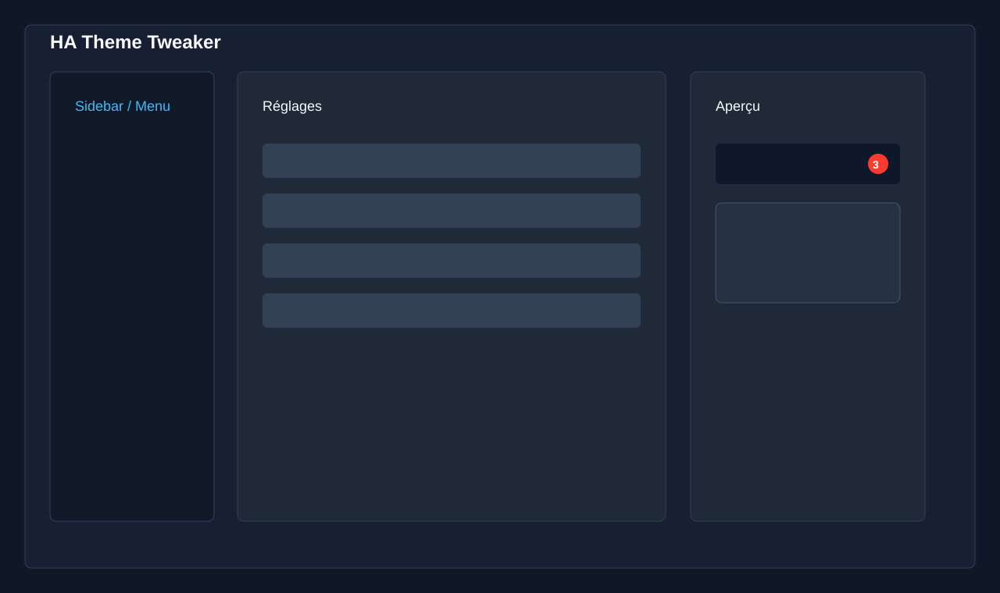

# HA Theme Tweaker

HA Theme Tweaker est une intégration custom Home Assistant installable avec HACS. Elle ajoute un panneau de configuration et applique des surcharges CSS persistantes au-dessus du thème actif, sans créer ni modifier le fichier YAML du thème d'origine.



## Statut

Première version MVP réellement installable :

- dépôt compatible HACS en type `Integration`
- panneau admin `Theme Tweaker` dans la sidebar
- stockage persistant via `.storage/ha_theme_tweaker`
- script frontend global chargé par Home Assistant
- surcharges CSS réinjectées après changement de thème ou navigation
- personnalisation dédiée des badges du sidebar Home Assistant
- reset individuel et reset complet

## Installation Avec HACS

1. Publier ce dossier dans le dépôt GitHub `Philiphall6/ha-theme-tweaker`.
2. Dans Home Assistant, ouvrir HACS.
3. Menu `...` puis `Custom repositories`.
4. Ajouter l'URL du dépôt GitHub.
5. Choisir le type `Integration`.
6. Installer `HA Theme Tweaker`.
7. Redémarrer Home Assistant.
8. Aller dans `Paramètres > Appareils et services > Ajouter une intégration`.
9. Chercher `HA Theme Tweaker`, puis valider.
10. Ouvrir le panneau `Theme Tweaker` dans la sidebar.

## Utilisation

Le panneau propose ces catégories :

- `Sidebar / Menu` : fond, icônes, texte, élément sélectionné, survol
- `Badges` : fond, texte, bordure, rayon, taille, graisse, largeur minimum, hauteur
- `Couleurs générales` : variables Home Assistant courantes comme `primary-color`, `accent-color`, `card-background-color`
- `Cards` : fond, bordure, rayon, ombre, texte, icônes
- `Mushroom` : variables optionnelles, sans dépendance à Mushroom Cards
- `Header / Toolbar` : fond, texte, icônes, accent

Chaque valeur vide est enregistrée comme `null`, ce qui signifie : conserver la valeur du thème actif.

## Aperçu Et Sauvegarde

Les changements sont appliqués en direct dans le navigateur pour prévisualisation. Cliquer sur `Sauvegarder` persiste les valeurs côté Home Assistant. Les autres navigateurs ouverts reçoivent la mise à jour via WebSocket.

Le bouton de reset sur chaque ligne remet uniquement cette variable à `null`. Le bouton `Tout réinitialiser` supprime toutes les surcharges.


## Désinstallation

1. Ouvrir `Theme Tweaker`.
2. Cliquer sur `Tout réinitialiser`.
3. Supprimer l'intégration dans `Paramètres > Appareils et services`.
4. Désinstaller `HA Theme Tweaker` depuis HACS.
5. Redémarrer Home Assistant ou faire un rafraîchissement complet du navigateur.

## Architecture

```text
ha-theme-tweaker/
├── README.md
├── LICENSE
├── hacs.json
├── info.md
├── package.json
├── .github/
│   └── workflows/
│       └── validate.yml
├── custom_components/
│   └── ha_theme_tweaker/
│       ├── __init__.py
│       ├── config_flow.py
│       ├── const.py
│       ├── manifest.json
│       ├── storage.py
│       ├── websocket.py
│       ├── frontend/
│       │   ├── ha-theme-tweaker.js
│       │   ├── panel.js
│       │   ├── shadow-dom.js
│       │   ├── styles.js
│       │   └── components/
│       │       └── value-utils.js
│       └── translations/
│           ├── en.json
│           └── fr.json
└── docs/
    └── images/
        ├── panel-overview-placeholder.svg
        └── sidebar-badges-placeholder.svg
```

## Détails Techniques

L'intégration enregistre un chemin statique via `hass.http.async_register_static_paths`, charge `ha-theme-tweaker.js` avec `add_extra_js_url`, puis expose des commandes WebSocket pour lire, sauvegarder et réinitialiser les réglages.

Le panneau est enregistré avec `panel_custom.async_register_panel` et reste réservé aux administrateurs. La lecture des réglages reste disponible pour toutes les sessions authentifiées afin que les surcharges visuelles s'appliquent aussi aux utilisateurs non-admin.

Les données sont stockées ainsi :

```json
{
  "settings": {
    "sidebar_badge_background": "#ff3b30",
    "sidebar_badge_text": "#ffffff",
    "card_radius": "16px",
    "primary_color": null
  }
}
```

## Shadow DOM

Les variables globales Home Assistant sont appliquées par héritage CSS quand c'est possible. Les badges du menu nécessitent un traitement spécifique, car le composant `ha-sidebar` rend actuellement les compteurs dans son `shadowRoot` avec la classe `.badge`.

La logique fragile est isolée dans `frontend/shadow-dom.js`. Si Home Assistant renomme `.badge`, ferme le shadow root, ou change fortement `ha-sidebar`, seules les surcharges spécifiques aux badges du sidebar devront être adaptées. Les surcharges de variables CSS générales continueront à fonctionner.

## Compatibilité

- Home Assistant `2025.7.0` ou plus récent
- HACS `2.0.0` ou plus récent
- navigateurs desktop modernes
- application Android Home Assistant
- application iOS Home Assistant
- mode clair et mode sombre

## Développement

Vérifications locales :

```bash
python -m compileall custom_components
node --check custom_components/ha_theme_tweaker/frontend/styles.js
node --check custom_components/ha_theme_tweaker/frontend/shadow-dom.js
node --check custom_components/ha_theme_tweaker/frontend/ha-theme-tweaker.js
node --check custom_components/ha_theme_tweaker/frontend/panel.js
node --check custom_components/ha_theme_tweaker/frontend/components/value-utils.js
```

Le workflow GitHub Actions exécute aussi la validation HACS avec `category: integration` et ignore uniquement le contrôle `brands` tant que le projet reste un dépôt personnalisé HACS.
