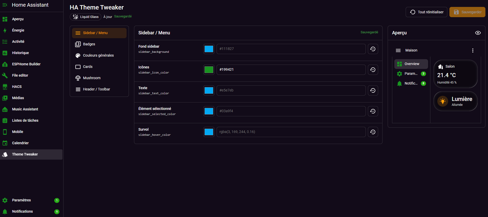
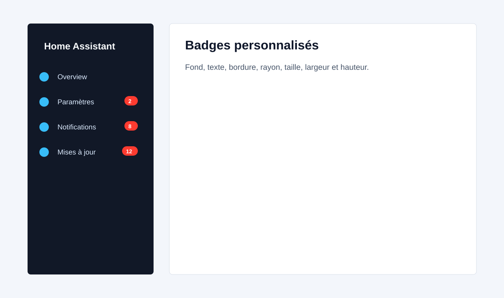

# HA Theme Tweaker

HA Theme Tweaker is a custom Home Assistant integration installable with HACS. It adds an admin panel and applies persistent CSS overrides on top of the active theme, without creating or editing the original theme YAML file.



## Status

Installable release:

- HACS-compatible repository as an `Integration`
- admin-only `Theme Tweaker` panel in the sidebar
- persistent storage through `.storage/ha_theme_tweaker`
- global frontend script loaded by Home Assistant
- CSS overrides re-injected after theme changes and navigation
- mobile menu button for narrow Home Assistant views
- clickable Home Assistant-style preview that jumps to the related setting
- per-color opacity controls with `rgba(...)` output
- device scope for applying overrides to web, mobile, or both
- dedicated Home Assistant sidebar badge customization
- per-setting reset and full reset

## Installation With HACS

1. In Home Assistant, open HACS.
2. Open the `...` menu, then select `Custom repositories`.
3. Add `https://github.com/Philiphall6/ha-theme-tweaker`.
4. Select the `Integration` category.
5. Install `HA Theme Tweaker`.
6. Restart Home Assistant.
7. Go to `Settings > Devices & services > Add integration`.
8. Search for `HA Theme Tweaker`, then confirm.
9. Open the `Theme Tweaker` panel from the sidebar.

## Usage

The panel provides these categories:

- `Device Scope`: apply saved overrides on web, mobile, or both
- `Sidebar / Menu`: background, icons, text, selected item, hover state
- `Badges`: background, text, border, radius, font size, font weight, minimum width, height
- `General Colors`: common Home Assistant theme output variables such as `--accent-color`, `--text-accent-color`, and `--card-background-color`
- `Cards`: background, border, radius, shadow, text, icons
- `Mushroom`: optional variables, with no Mushroom Cards dependency required
- `Header / Toolbar`: background, text, icons, accent

Every empty value is saved as `null`, which means Home Assistant keeps inheriting the value from the active theme. Color pickers for mapped Home Assistant variables can show the inherited theme value as a starting point; the opacity slider stores transparent colors as `rgba(...)`. Once you save an override, more specific sections such as Sidebar, Cards, Mushroom, and Header remain applied on top.

## Live Preview And Saving

Changes are applied live in the current browser so you can preview them immediately. The preview can be clicked to jump from a Home Assistant-style element to the matching setting. Click `Save` to persist the values in Home Assistant. Other open browsers receive the update through WebSocket.

The reset button on each row only clears that variable back to `null`. The `Reset all` button removes every override.



## Uninstall

1. Open `Theme Tweaker`.
2. Click `Reset all`.
3. Remove the integration from `Settings > Devices & services`.
4. Uninstall `HA Theme Tweaker` from HACS.
5. Restart Home Assistant or perform a full browser refresh.

## Architecture

```text
ha-theme-tweaker/
|-- README.md
|-- LICENSE
|-- hacs.json
|-- info.md
|-- package.json
|-- .github/
|   `-- workflows/
|       `-- validate.yml
|-- custom_components/
|   `-- ha_theme_tweaker/
|       |-- __init__.py
|       |-- config_flow.py
|       |-- const.py
|       |-- manifest.json
|       |-- storage.py
|       |-- websocket.py
|       |-- frontend/
|       |   |-- ha-theme-tweaker.js
|       |   |-- panel.js
|       |   |-- shadow-dom.js
|       |   |-- styles.js
|       |   `-- components/
|       |       `-- value-utils.js
|       `-- translations/
|           |-- en.json
|           `-- fr.json
`-- docs/
    `-- images/
        |-- ha-theme-tweaker-panel.svg
        |-- panel-overview-placeholder.svg
        `-- sidebar-badges-placeholder.svg
```

## Technical Details

The integration registers a static path with `hass.http.async_register_static_paths`, loads `ha-theme-tweaker.js` with `add_extra_js_url`, and exposes WebSocket commands to read, save, and reset settings.

The panel is registered with `panel_custom.async_register_panel` and is restricted to administrators. Reading settings remains available to every authenticated session so visual overrides can also apply to non-admin users.

Data is stored like this:

```json
{
  "settings": {
    "target_device": "mobile",
    "accent_color": "#03a9f4",
    "text_accent_color": "rgba(255, 255, 255, 0.82)",
    "sidebar_badge_background": "#ff3b30",
    "sidebar_badge_text": "#ffffff",
    "card_radius": "16px",
    "primary_color": null
  }
}
```

## Shadow DOM

Global Home Assistant variables are applied through CSS inheritance whenever possible. Sidebar badges need specific handling because the `ha-sidebar` component currently renders counters inside its `shadowRoot` with the `.badge` class.

The fragile logic is isolated in `frontend/shadow-dom.js`. If Home Assistant renames `.badge`, closes the shadow root, or heavily changes `ha-sidebar`, only the sidebar badge-specific overrides should need adjustment. General CSS variable overrides will continue to work.

## Compatibility

- Home Assistant `2025.7.0` or newer
- HACS `2.0.0` or newer
- modern desktop browsers
- Home Assistant Android app
- Home Assistant iOS app
- light and dark modes

## Development

Local checks:

```bash
python -m compileall custom_components
node --check custom_components/ha_theme_tweaker/frontend/styles.js
node --check custom_components/ha_theme_tweaker/frontend/shadow-dom.js
node --check custom_components/ha_theme_tweaker/frontend/ha-theme-tweaker.js
node --check custom_components/ha_theme_tweaker/frontend/panel.js
node --check custom_components/ha_theme_tweaker/frontend/components/value-utils.js
```

The GitHub Actions workflow runs HACS validation with `category: integration`, official Home Assistant Hassfest validation, Python compilation, and JavaScript syntax checks.
